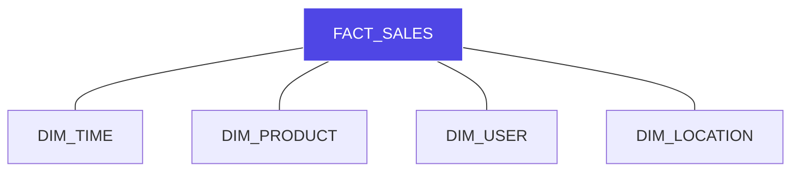

# Data Warehousing: The Architecture of Intelligence

In high-fidelity system design, we distinguish between **Transactional Flow** (OLTP) and **Analytical Synthesis** (OLAP). One handles the present; the other predicts the future.

---

### 1️⃣ Transactions vs. Analytics (The Great Rift)

| Aspect | OLTP (Online Transactional) | OLAP (Online Analytical) |
| :--- | :--- | :--- |
| **Purpose** | Day-to-day operations. | Strategic data mining & insights. |
| **Nature** | Short, rapid atomicity. | Long, complex aggregations. |
| **DB Design** | Normalized (ER Model). | De-normalized (Star/Snowflake). |

---

### 2️⃣ Dimensional Manifolds (Schema Architectures)

#### A. The Star Schema (The Core Primitive)
A central "Fact Table" surrounded by "Dimension Tables". It is the most efficient protocol for query performance.

#### B. The Snowflake Schema (The Normalized Extension)
When dimension tables are normalized into further tables, we call it a "Snowflake". It saves space but incurs higher join latency.

#### C. The Galaxy Schema (The Enterprise Standard)
Multiple fact tables sharing dimension tables. This represents a complex multidimensional manifold of an entire corporation.

---

### 3️⃣ The ETL Pipeline: The Data Refinement Protocol
1. **Extract**: Pull raw data from OLTP sources.
2. **Transform**: Scrub, filter, and aggregate the data into the analytical format.
3. **Load**: Commit the refined data into the Data Warehouse.

---

### 4️⃣ Interactive Mission: The "Schema Trace"
**Scenario**: You are designing MUSTSHOP's analytics engine.
**The Exercise**:
1. Identify the **Fact** (e.g., Orders).
2. Identify the **Dimensions** (e.g., Dates, Students, Items).
3. **Decision**: Should we use a Star or a Snowflake if we have 1 billion item variations but limited query time?

---

## 🛑 Common Failure Analysis
❌ **Data Silos**: Failing to integrate disparate OLTP sources into a unified warehouse.
❌ **Schema Rigidity**: Building a Snowflake schema that causes query timeouts due to excessive joins.
