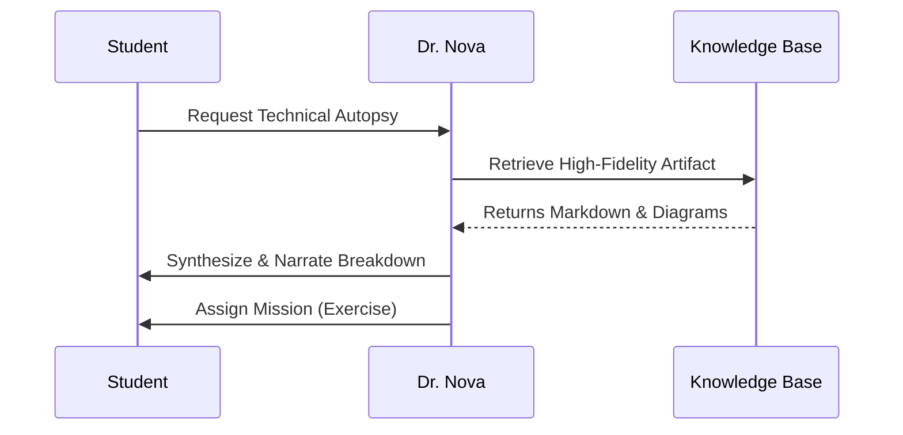

# Software Engineering Architecture: Blueprints & Methodologies

As your **Principal Architect**, I look beyond the source code. I see the **Systemic Anatomy** and the **Procedural Protocols** that govern how we build robust manifolds of logic.

---

### 1️⃣ The Unified Modeling Language (UML)
UML is our blueprint language. It allows us to visual the static and dynamic state of the architecture before a single line of code is committed.

#### A. The Use Case Diagram (Functional Scope)
**The Goal**: Define the boundaries of the system and the actors interacting with it.

```mermaid
useCaseDiagram
    actor "System Architect" as Admin
    actor "Student" as User
    
    Admin --> (Manage Knowledge Base)
    Admin --> (Oversee AI Synthesis)
    User --> (Consult Dr. Nova)
    User --> (Perform Trace Exercise)
    (Perform Trace Exercise) ..> (Consult Dr. Nova) : <<include>>
```

#### B. The Sequence Diagram (Temporal Logic)
**The Goal**: Visualize the interaction between objects in a time-ordered sequence.



#### C. The Activity Diagram (Flow of Control)
**The Goal**: Visualize the step-by-step workflow of a business process or algorithm.

```mermaid
activityDiagram
    start
    :Initialize Session;
    if (KB Entry Found?) then (yes)
        :Inject Curated Context;
    else (no)
        :Generate Dynamic Insights;
    endif
    :Dr. Nova Synthesis;
    :Enable STT/TTS Interface;
    stop
```

---

### 2️⃣ Architectural Methodologies: The Lifecycle Protocol

#### The Waterfall vs. Agile Paradigm
| Aspect | Waterfall (Linear) | Agile (Iterative) |
| :--- | :--- | :--- |
| **Logic** | Sequentially locked phases. | Parallel sprints with continuous feedback. |
| **Risk** | High (Failures detected late). | Low (Constant validation). |
| **Architect's Role** | Up-front planning & rigid spec. | Living system evolution. |

---

### 3️⃣ Interactive Mission: The "Waterfall Trace"
**Scenario**: You are tasked with building a GPS system for a high-security drone. 
**The Exercise**:
1. **Requirements**: Define the drone's constraints.
2. **Design**: Build the UML sequence diagram.
3. **Implementation**: Commit the navigation protocol.
4. **Verification**: Execute the flight simulation.

> **Dr. Nova**: Trace the dependencies in this flow. What happens if the 'Design' phase fails to account for GPS signal loss? 

---

## 🛑 Common Failure Analysis
❌ **Over-Engineering**: Creating complex UML for simple manifolds.
❌ **Agile Drift**: Losing sight of the long-term architecture while focused on short-term sprints.
